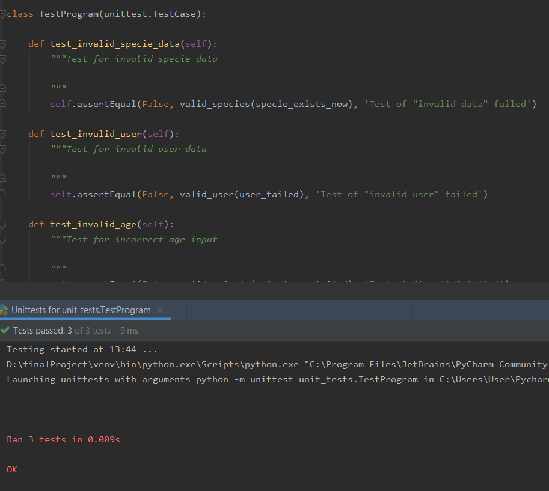

REST API on Flask

==================

INSTALLATION
-----------

You can clone or download this project on your own computer.

You shall see the following files and directories:

    app/            directory that can start the program
    db/             contains all databases that used in program
    error_variable/     variables can display when something gone wrong
    logger/         logging program runtime actions
    test/           tests for program
    validation/     check correct input from user
    config          configuration file
    database        contains all databses
    README          this file
    requirements    contains all third-libraries with versions
    test        screenshot of running test
    warning     file contains all warning log
    work        file contains all not warning log
    
    
REQUIREMENTS
-----------
The minimum version of Python should be 3.0.
You should use the "Postman". Because this REST API was tested and created with help of "Postman"

For input you should use JSON format. For Example:
        
        {
            "Name": "London center",
            "Password": "qwerty",
            "Address": "London"
        }

Make sure, you have the following third-libraries:

        alembic
        Click
        Flask
        Flask-Migrate
        Flask-SQLAlchemy
        itsdangerous
        Jinja2
        Mako
        MarkupSafe
        pip3-multiple-versions
        PyJWT
        python-dateutil
        python-editor
        six
        SQLAlchemy
        Werkzeug
        
QUICK START
----------

You can use REPL to start this program.
Past the following command to REPL: 

    from app.start_app import*
    
then press "Enter" and then open "Postman" and copy url from REPL command line and past to "POSTMAN".

You can also start program from some IDEA which contains "Python Console" and put there th following command:

    from app.start_app import*

If you login, you get the token in "POSTMAN" console, you should copy it and past in url by whe following example:

        http://127.0.0.1:5001/animals?token=your_token
        
        
You can the following url:

    POST methods    
    http://127.0.0.1:5001/register                   register center
    http://127.0.0.1:5001/animals?token=some_token   register animal by token
    http://127.0.0.1:5001/species?token=some_token   register specie
    
    GET methods
    http://127.0.0.1:5001/login         login of some center and get token
    http://127.0.0.1:5001/animals       get all animals
    http://127.0.0.1:5001/species       get all species with amounts
    http://127.0.0.1:5001/centers       get all centers
    http://127.0.0.1:5001/centers/id    get information about some center by id
    http://127.0.0.1:5001/animals/id    get information about some animal by id   
    http://127.0.0.1:5001/species/id    get information about some specie by id 
    
    DELETE method 
    http://127.0.0.1:5001/animals/id?token=some_token    delete animal by id with token
    
    PUT method
    http://127.0.0.1:5001/animals/id    update some animal by id
    

THE RESULT OF TESTS
-------------------

